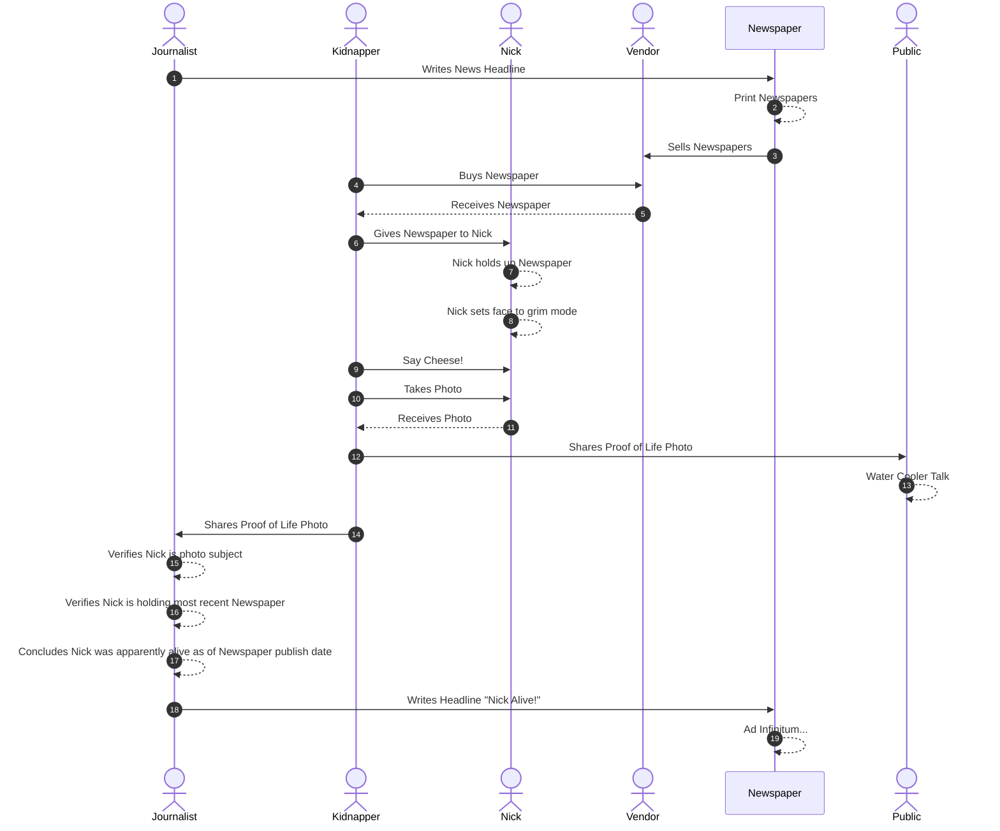
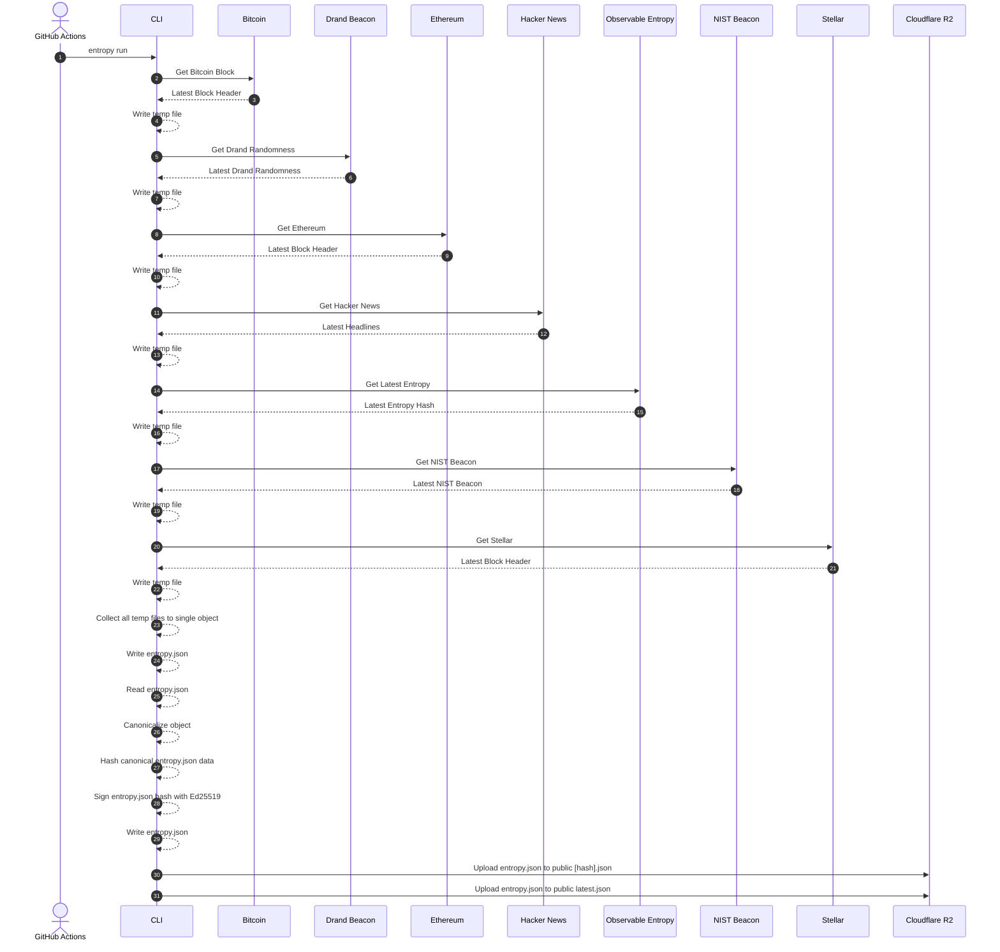

# Observable Entropy


:eye: :game_die:

Incontestable and verifiable public randomness is a powerful tool that is useful for a wide variety of use cases. The Observable Entropy project collects public sources of randomness and digests them into a single `SHA-256` hash stored in a JSON file along with the original data. This has can be used in any context where someone wants to prove that some event happened **after** the hash was created.

## NOTE

This is `v2` of the observable entropy project. The experimental first version, which was previously found at `https://github.com/truestamp/observable-entropy`, is no longer available. It was necessary to be removed due to excessive growth of the Git repository it was stored in.

This version has been enhanced in many ways, and no longer uses Git as it's storage mechanism. This new version should be faster and should reflect the addition of new Entropy instantly.

## Why do we need incontestable randomness?

This project was in-part inspired by the presentation [TRUST, AND PUBLIC ENTROPY: A UNICORN HUNT](https://csrc.nist.gov/csrc/media/events/random-bit-generation-workshop-2016/documents/presentations/sessionv-3-benjamin-wesolowski-presentation.pdf) and the associated paper
[A random zoo: sloth, unicorn, and trx](https://eprint.iacr.org/2015/366).

Among other uses, when included in the process of publishing data (or the hash of some data), it can be useful to prove that something was **published** after a specific point in time.

A subtle distinction is that it does not prove something was **created** after a specific moment in time (although that may also be true). For example, if I published the collected works of Shakespeare and included the latest Entropy hash along with it, it would only prove that I published the data after the entropy hash was generated, not that I authored it, or created it after that moment in time.

There are **many** other uses for provably random data. For some further reading take a look at:

- [Trust and Public Entropy : A Unicorn Hunt](https://csrc.nist.gov/csrc/media/events/random-bit-generation-workshop-2016/documents/presentations/sessionv-3-benjamin-wesolowski-presentation.pdf)
- [Randomness 101 : Lavarand in Production](https://blog.cloudflare.com/randomness-101-lavarand-in-production/)
- [League of Entropy : Making randomness truly random](https://onezero.medium.com/the-league-of-entropy-is-making-randomness-truly-random-522f22ce93ce)
- [Why are countries creating public random number generators?](https://www.sciencemag.org/news/2018/06/why-are-countries-creating-public-random-number-generators)
- [On Bitcoin as a Public Randomness Source](https://eprint.iacr.org/2015/1015.pdf)
- [Cryptographic Beacons (a.k.a. Randomness Beacons)](http://www.copenhagen-interpretation.com/home/cryptography/cryptographic-beacons)

## "Proof of Life"

A trope often found in the movies is a story where a kidnap victim is photographed with a current newspaper as "proof of life". The idea being that if the victim is seemingly alive and well in the photo, and the photo can be reliably verified to have been taken after the headlines in the paper were written, then the victim is presumed OK as of _that_ moment in time. The smaller the window of time between the headline being published and now, the more likely that the victim is still unharmed.

Here's an example with our friend Nick[^1].

[^1]: [Was Nicholas Cage in peril?](https://twitter.com/mashant/status/946734525392015360)

[](https://twitter.com/mashant/status/946734525392015360)

If we use a seqeunce diagram we can see how the headline fits in.



## A better way

Lets carry this analogy a bit further. Newspapers are fine, and they work for this purpose in the movies because we believe that it is hard to predict a newspaper's front page in advance. So it is therefore unlikely, for example, that the kidnapper took the photo a year ago and guessed correctly what the headline and the rest of the visible text on the page would be in advance.

It has some flaws:

- Are you familiar with that newspaper?
- Do you trust that the newspaper publisher incorruptible?
- Can you verify it by finding and examining your own copy?
- Does the newspaper content fit with the historical record?

Imagine instead there was a better way. One where there is no corruptible publisher. Were the chances of guessing future answers are so small you could not do so, even given limitless time on a universe age scale, with all the compute power in the universe.

### Randomness in our world

There are a multitude of sources of pure randomness in our world.  Some derived from natural phenomenon, some from random sources we're familiar with like the roll of dice, newspaper headlines, blockchain headers, and lottery numbers.

Some of these sources of randomness allow us to verify them after the fact. We can go back and examine newspaper archives. Lottery winning numbers are published broadly. Blockchain explorers allow us to review each historical and immutable block whose hash represents all of the transactions committed to by that block.

If we tap into this randomness, and choose sources that we can verify after the fact, we can combine them all together into a new value that represents all of them. Cryptographic hashes are a powerful way for us to digest all of that information into a single convenient hash value that represents all of them.

### Collecting It

For this project we collect and combine these sources of randomness and digest them into a single hash value that is convenient to use. An important part of the system though is to keep the original, pre-hashing, content around so that it can be independently verified just as we did with the newspaper headline.

The final output of this process is a file we'll archive that contains all the collected randomness and a hash of all of it. The hash looks like:

`0eeb71aed3e54c11c2f93c1cba15f7b05a16526740f69364b25364834110bc1f`

## Public Entropy Sources

The following sources are those that this project currently tries to collect verifiable randomness from.

### Bitcoin Blockchain

The latest block header info as provided by the `https://blockchain.info/latestblock` API.

The Bitcoin block data can be independently verified by visiting the [blockchain.com](https://www.blockchain.com/explorer?view=btc) block explorer (or another of your choosing).

Using the `hash` value from the stored `bitcoin` property of `entropy.json` you can visit a URL to view info about that block:

Example:

[https://www.blockchain.com/btc/block/000000000000000000073e1f0e0ad829aec961c29e1ef8d632ee55401fc248ec](https://www.blockchain.com/btc/block/000000000000000000073e1f0e0ad829aec961c29e1ef8d632ee55401fc248ec)

### Drand Random Beacon

The latest random data generated by [Drand beacon](https://drand.love/), which provides "Verifiable, unpredictable and unbiased random numbers as a service".

The Drand beacon data can be independently verified using the Rust [drand-verify](https://github.com/CosmWasm/drand-verify) tool and passing it the `round`, `previous_signature`, and `signature` values from the `drand-beacon` property of `entropy.json`.

Example:

```sh
$ cargo run --example drand_verify 982693 a1b1adf7f7dd1ca61d1772859991fd68fb4bd282622247b41cc483476f4d16d8d862fcb5c518d21e11b12d44480e631604326bd9a5c385f634782152a10df702386bf30d77e9cdc96f42b0c29bb0696aecc5a4ab5987a396a8007a6867e2c8e5 961f28f2fc98e1a150d198a26d14b481fb6def08b5b8a5312dec22117f063a39b99d892f54231dbb260bb09771647c3d056d0bb20919175eb121f1092b7d8499818ebd7ccdf87fb9f8da60cd29eab975516c4b9331199d32c1ea6bc010cfc954
    Finished dev [unoptimized + debuginfo] target(s) in 0.06s
     Running `target/debug/examples/drand_verify 982693 a1b1adf7f7dd1ca61d1772859991fd68fb4bd282622247b41cc483476f4d16d8d862fcb5c518d21e11b12d44480e631604326bd9a5c385f634782152a10df702386bf30d77e9cdc96f42b0c29bb0696aecc5a4ab5987a396a8007a6867e2c8e5 961f28f2fc98e1a150d198a26d14b481fb6def08b5b8a5312dec22117f063a39b99d892f54231dbb260bb09771647c3d056d0bb20919175eb121f1092b7d8499818ebd7ccdf87fb9f8da60cd29eab975516c4b9331199d32c1ea6bc010cfc954`
Verification succeeded
Randomness: 92577f74a8bd0617c48f6e8bf14fa8b04daaded87b5d2d7b0a5aafb89f403a6d
```

More information:

- [League of Entropy](https://www.cloudflare.com/leagueofentropy/)
- [League of Entropy: Not All Heroes Wear Capes](https://blog.cloudflare.com/league-of-entropy/)
- [drand/drand-client](https://github.com/drand/drand-client)

Both the current published Drand chain info, and the public randomness data
generated is collected.

### Ethereum Blockchain

The latest block header info as provided by the `https://api.blockcypher.com/v1/eth/main` API.

The Ethereum block data can be independently verified by visiting the [blockcypher.com](https://live.blockcypher.com/eth/) block explorer (or another of your choosing).

Using the `hash` value from the stored `ethereum` property of `entropy.json` you can visit a URL with info about that block:

Example:

[https://live.blockcypher.com/eth/block/17e369d2546b865cbd7ee8cd69ce4f0c11df451738b23a6bdd4c21dcb0ac6bcf/](https://live.blockcypher.com/eth/block/17e369d2546b865cbd7ee8cd69ce4f0c11df451738b23a6bdd4c21dcb0ac6bcf/)

### Hacker News

The current top 10 news story headlines and links as provided by the [Hacker News API](https://github.com/HackerNews/API).

This data can be verified manually by inspecting the content, specifically the headlines in the stories, and identifying their context in time based on the publish time of the linked stories and the story context.

### Latest Entropy

Verifiable manually.

A backlink to the hash from a previous run of Observable Entropy. This chains together all observable entropy files based on the hash of their content with each referencing the previous.

At the time entropy is captured, a request is made to [https://entropy-v2.truestamp.com/latest](https://entropy-v2.truestamp.com/latest) and the `hash` property value is extracted and incorporated in the new entropy.

To verify, check that an entropy file exists at that named URL and contains the same `hash` value.

For example, if the current value is `712c91451728fdd604643cc7395eaa833d16231590808a7eccee115f7936f93b` check that the URL `https://entropy-v2.truestamp.com/712c91451728fdd604643cc7395eaa833d16231590808a7eccee115f7936f93b` has that same value in the `hash` property.

### NIST Randomness Beacon

The current `pulse` from the [NIST Randomness Beacon](https://beacon.nist.gov/home) (Version 2.0 Beta).

Detailed info about this beacon can be found in the [NIST paper : A Reference for Randomness Beacons](https://nvlpubs.nist.gov/nistpubs/ir/2019/NIST.IR.8213-draft.pdf)

The data provided by the NIST Beacon is independently verifiable using the `chainIndex` and `pulseIndex` values in the `nist-beacon` property of `entropy.json`.

Verification URL : `https://beacon.nist.gov/beacon/2.0/chain/<chainIndex>/pulse/<pulseIndex>`

Example:

[https://beacon.nist.gov/beacon/2.0/chain/1/pulse/1442043](https://beacon.nist.gov/beacon/2.0/chain/1/pulse/1442043)

Comparison of the `outputValue` should be sufficient to confirm that the value captured was the one provided in the pulse.

### Stellar Blockchain

The latest Stellar ledger (block) data as collected from the `https://horizon.stellar.org/fee_stats` and `https://horizon.stellar.org/ledgers/{ID}` API endpoints.

The `/fee_stats` API is used to identify the latest ledger `ID` and the rest of its output is then discarded.

The `/ledgers` API is then used to retrieve the full ledger data for that `ID`.

The Stellar ledger data is stored in the `stellar` property of `entropy.json`. It can be independently verified by extracting the `sequence` number (the block height), and comparing stored values like the ledger `hash` and `closed_at` timestamp in the file to the "Ledger hash" and "Closed at" attributes on the page. Other values may be compared as well.

Example:

Using the URL format `https://stellar.expert/explorer/public/ledger/:ledgerId`:

[https://stellar.expert/explorer/public/ledger/36119209](https://stellar.expert/explorer/public/ledger/36119209)

### Timestamp

For convenience, the `ISO8601` formatted UTC timestamp, according to the server hosting the capture script, is captured as `timestamp.capturedAt`.

This should be the last information captured.

## Collection Protocol

Some additional information about how, and how often, this information is collected.

### Sequence Diagram



### Data Format

The main structure of an entropy file is a JSON object with a `data` top-level property. The entropy data collected from each source is stored as a property of `data`. If any of the sources are not able to be collected for a particular run they are omitted.

Once the collection phase is complete, the content of the `data` property is canonicalized using the [@truestamp/canonify](https://github.com/truestamp/truestamp-canonify) library, and the canonical results are hashed with `SHA-256` and signed with an `ed25519` signature. All of this information is stored in the `hash`, `publicKey`, `signature` and `signatureType` top-level properties alongside the `data`.

```json
{
  "data": {
    "bitcoin": {
      // ...
    },
    "drand-beacon": {
      "chainInfo": {
        // ...
      },
      "randomness": {
        // ...
      }
    },
    "ethereum": {
      // ...
    },
    "hacker-news": {
      "stories": [
        {
          // ...
        },
        {
          // ...
        },
      ]
    },
    "latest": {
      // ...
    },
    "nist-beacon": {
      // ...
    },
    "stellar": {
      // ...
    }
  },
  "hash": "...", // canonicalized SHA-256 hash of the data property
  "publicKey": "...", // The public key of the Ed25519 signing keypair
  "signature": "...", // The Base64 encoded Ed25519 signature
  "signatureType": "..." // The signature type. Always `ed25519` right
}

```

### Object Storage

The generated entropy is uploaded to [Cloudflare R2](https://www.cloudflare.com/products/r2/) object storage. Each time entropy is collected it is stored at the root level of `https://entropy-v2.truestamp.com` as `[hash].json` and also as `latest.json`.

The `latest.json` value is always overwritten by the newest entropy file.

Example URLS:

[https://entropy-v2.truestamp.com/latest](https://entropy-v2.truestamp.com/latest)

[https://entropy-v2.truestamp.com/0eeb71aed3e54c11c2f93c1cba15f7b05a16526740f69364b25364834110bc1f](https://entropy-v2.truestamp.com/0eeb71aed3e54c11c2f93c1cba15f7b05a16526740f69364b25364834110bc1f)

### Collection Schedule

An attempt is made to collect data from all sources on a five minute interval.

The `hash` that represents all canonicalized collected data is found under the `hash` property.

The status of recent job runs can be viewed in the [Actions](https://github.com/truestamp/observable-entropy-v2/actions) tab of this repository.

## Verification

The entropy data captured, and the hash generated from it, is designed to be easily verifiable.

The CLI tool in this repository has a `verify` command that will locally perform the verification of the hash and the signature of an entropy file.  You can reference such a file by:

- latest: the latest stored file on the network which will be fetched and locally verified.
- the `hash`, which will fetch the file from the network by filename and locally verify it.
- a `file`, which is expected to be a local file archived on your system.

To pass this verification the CLI will:

- ensure that the filename in the form `[hash].json` matches the `hash` property in the file.
- canonicalize and hash with `SHA-256` the `data` property in the entropy file found.
- ensure that the resulting hash matches the one found in the file.
- ensure that the public key in the file is found on the Truestamp key server.
- ensure that the `Ed25519` signature in the file is valid for the `hash` value.

The public key that can be used to verify the signature is added to the `publicKey` property as Base64 encoded text. This public key MUST also be able to be found at [https://keys.truestamp.com](https://keys.truestamp.com).

At the time of publishing the current Base64 encoded `Ed25519` public keys is:

`NfvSZ30CwBNJltF+o9Nda4b9wHerhXugFzv8fM8O2Go=`

If any of these steps fail the verification will also fail.

This verification process does not verify the validity of each entropy type against its own source. Instructions for doing for each entropy type are shown above.

## Usage

### CLI Usage

The only pre-requisites are `git` and the `deno` runtime installed by following the [Deno installation steps](https://deno.land/#installation). `git` is installed on most operating systems by default.

Please use Deno `v1.28.0` or higher (check with `deno --version`).

```txt
# Clone the repo
git clone https://github.com/truestamp/observable-entropy-v2.git

# Change directory
cd observable-entropy-v2

# OPTION ONE : A specific entropy hash
# Replace hash with the one you want to verify.

deno run -A --import-map=import_map.json src/observable.ts verify --hash 0eeb71aed3e54c11c2f93c1cba15f7b05a16526740f69364b25364834110bc1f

# OPTION TWO : The latest entropy hash

deno run -A --import-map=import_map.json src/observable.ts verify --latest

# OPTION THREE : A local entropy.json file

deno run -A --import-map=import_map.json src/observable.ts verify --file entropy.json
```

### Download

All files are available for download from a public storage bucket.

### Latest

Returns the latest entropy file.

[https://entropy-v2.truestamp.com/latest](https://entropy-v2.truestamp.com/latest)

### Fetch by Entropy Hash (`sha256`)

Returns the contents of the `[hash].json` that has a specific entropy `hash` value.

`https://entropy-v2.truestamp.com/:hash`

[https://entropy-v2.truestamp.com/0eeb71aed3e54c11c2f93c1cba15f7b05a16526740f69364b25364834110bc1f](https://entropy-v2.truestamp.com/0eeb71aed3e54c11c2f93c1cba15f7b05a16526740f69364b25364834110bc1f)
